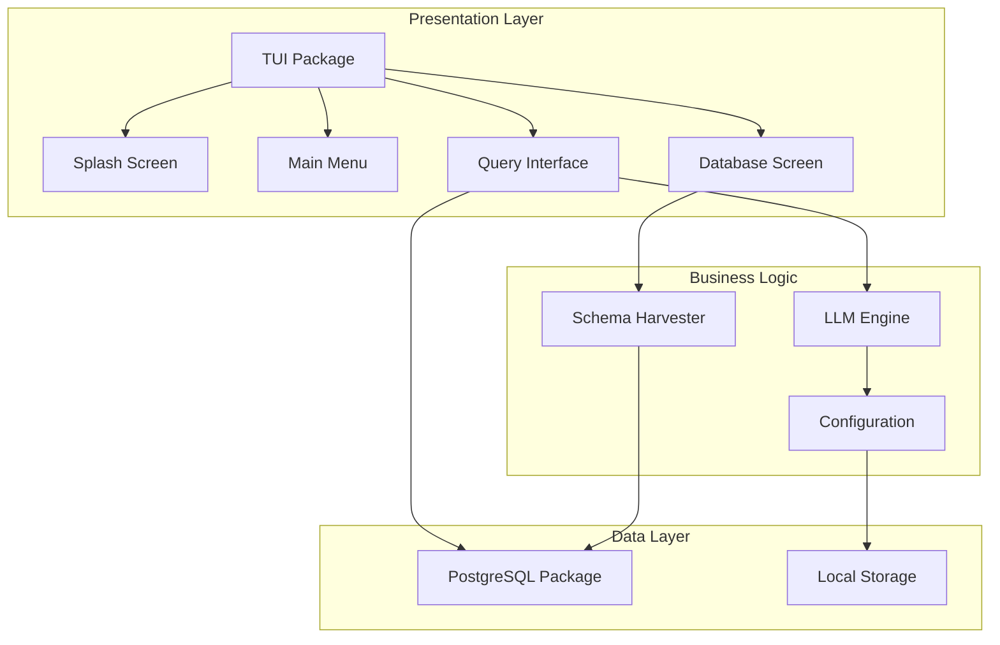

# Architecture

Kartoza PG AI follows a clean architecture with clear separation of concerns.

## Overview



## Package Structure

```
kartoza-pg-ai/
├── cmd/                    # CLI commands
│   ├── root.go            # Main command
│   ├── version.go         # Version command
│   └── status.go          # Status command
├── internal/              # Private packages
│   ├── tui/               # Terminal UI
│   │   ├── app.go         # Main application model
│   │   ├── menu.go        # Main menu
│   │   ├── query.go       # Query interface
│   │   ├── database.go    # Database selection
│   │   ├── splash.go      # Splash screens
│   │   └── widgets.go     # Shared components
│   ├── postgres/          # PostgreSQL integration
│   │   ├── service.go     # pg_service.conf parser
│   │   └── schema.go      # Schema harvester
│   ├── llm/               # LLM integration
│   │   └── engine.go      # Query engine
│   └── config/            # Configuration
│       └── config.go      # App configuration
└── main.go                # Entry point
```

## Design Patterns

### Model-Update-View (Elm Architecture)

The TUI follows the Bubble Tea framework's Elm-inspired architecture:

```go
type Model interface {
    Init() tea.Cmd
    Update(msg tea.Msg) (tea.Model, tea.Cmd)
    View() string
}
```

### DRY Header System

All screens share a common header rendered by `RenderHeader()`:

```go
func RenderHeader(pageTitle string) string {
    // Consistent header across all screens
    // Shows: app name, page title, status bar
}
```

### Global Application State

Status information is shared via `GlobalAppState`:

```go
var GlobalAppState = &AppState{
    IsConnected:   false,
    ActiveService: "",
    SchemaLoaded:  false,
    TablesCount:   0,
    HasPostGIS:    false,
    Status:        "Ready",
}
```

## Data Flow

1. **User Input** → TUI captures keyboard/mouse events
2. **Message** → Input converted to typed message
3. **Update** → Model processes message, returns new state
4. **Command** → Async operations return commands
5. **View** → Model rendered to terminal

## Async Operations

Long-running operations use Bubble Tea commands:

```go
func (m *Model) executeQuery(query string) tea.Cmd {
    return func() tea.Msg {
        // Async database query
        result := db.Query(query)
        return queryResultMsg{result}
    }
}
```

## Schema Caching

Database schemas are cached locally to avoid repeated harvesting:

1. Check cache validity (TTL-based)
2. If valid, use cached schema
3. If invalid, harvest fresh schema
4. Store in `~/.config/kartoza-pg-ai/config.json`
